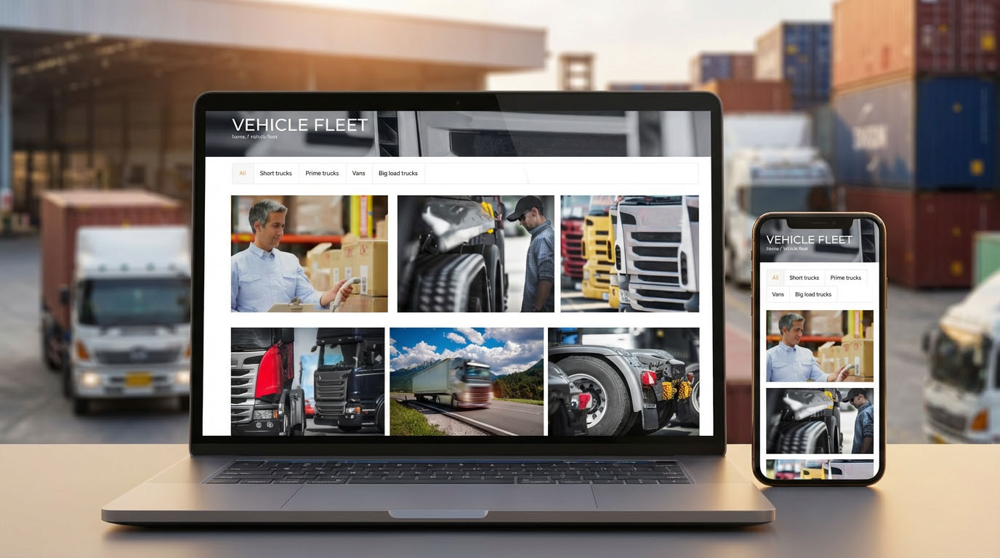
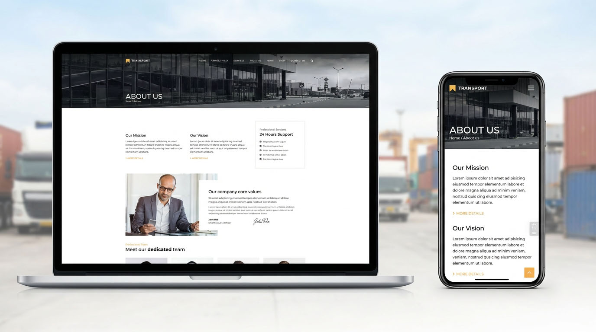

# Transport – Logistics & Trucking WordPress Theme

Transport is a professional Logistics & Trucking WordPress theme built for transportation companies, freight services, and logistics businesses that need a clear, reliable, and business-focused website.

The theme is designed to help transport companies present their services, capabilities, and company strengths in a structured way — making it easy for potential clients to understand what you do and request a quote or contact you.

---

## 🔗 Live Demo & Purchase
- [Theme page](https://anpsthemes.com/wordpress-theme/transport/)
- [Buy on ThemeForest](https://themeforest.net/checkout/from_item/11023307?license=regular&size=source&support=bundle_12month)
- [Live demo](https://anpsthemes.com/transport-landing-page/)

---

## ⭐ Why Choose Transport

- Industry-focused design for logistics and trucking companies  
- One-click demo import with multiple transport demos  
- WPBakery Page Builder included for visual editing  
- Service, fleet, and company sections built-in  
- Clean, fast-loading, and SEO-friendly structure  

---

## 🚚 Best Use Cases

Transport is ideal for:
- Trucking and freight companies
- Logistics and transportation services
- Courier and delivery businesses
- Warehouse and supply chain providers
- Transport companies serving B2B clients

---

## 🖼 Theme Screenshots

Below are example layouts included with the Transport theme.

---

## 🛠 Technology & Compatibility

- WordPress 6.x compatible
- PHP 8.x ready
- WPBakery Page Builder included
- WooCommerce supported
- Responsive and retina-ready
- Compatible with modern SEO and caching plugins

---

## 📌 Support & Updates

Theme updates and customer support are provided through ThemeForest.

[Support portal](https://anpsthemes.freshdesk.com/)

---

## ⚠ Important Notice

This GitHub repository is for **product presentation and informational purposes only**.  
Theme files are distributed exclusively via ThemeForest under Envato licensing.

---

## 🔗 Official Theme Page

Transport website:  
https://anpsthemes.com/wordpress-theme/transport/

Transport is a logistics and trucking WordPress theme built for transportation companies that need a professional website to present services, capabilities, and business credibility.

---

## 👋 About AnpsThemes

AnpsThemes builds premium WordPress themes for real businesses — focused on clarity, industry relevance, and long-term maintainability.

Official website: https://anpsthemes.com/
